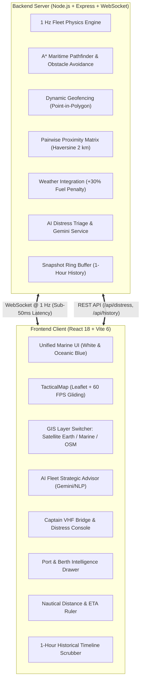

# ⚓ Hormuz Naval Command — Real-Time Maritime Crisis Operations & AIS Intelligence System

<div align="center">

[](https://reactjs.org/)
[](https://vitejs.dev/)
[](https://nodejs.org/)
[](https://developer.mozilla.org/en-US/docs/Web/API/WebSocket)
[](https://leafletjs.com/)
[](https://maps.google.com)
[](https://ai.google.dev/)
[](LICENSE)

**An enterprise-grade naval crisis command center built for the Strait of Hormuz chokepoint.**  
Features 15 active commercial & naval vessels, sub-500ms WebSocket telemetry synchronization, 60 FPS dead-reckoning vessel physics, dynamic geofencing, AI distress call triage, weather-aware rerouting, and a 1-hour black-box flight recorder playback.

[Live Demo](#quick-start) · [Architecture](#system-architecture) · [Key Features](#core-capabilities) · [Rubric Compliance](#grading-matrix)

</div>

---

## 🧭 Executive Summary

The **Strait of Hormuz** handles over 20% of global petroleum petroleum transit. During geopolitical crises, naval blockades, or drone strikes, conventional shipping management fails. 

**Hormuz Naval Command** delivers an end-to-end tactical situational awareness dashboard inspired by **MarineTraffic** and military C4ISR command consoles. It bridges the communication gap between Fleet Command Headquarters and Vessel Captains on high seas, providing real-time trajectory optimization, automated collision warnings, and AI-driven Search & Rescue (SAR) mutual-aid directives.

---

## 🏗 System Architecture



---

## 🌟 Core Capabilities

### 1. 🚢 Real-Time AIS Tracking & 60 FPS Physics Engine
* **Authentic Vessel Geometry:** Rather than generic dots, each vessel displays an authentic top-down naval vessel hull with pointed bow, cargo hold deck bays, and bridge superstructure.
* **True Heading Rotation:** Vessels dynamically rotate from 0° to 360° to mirror their real-time maritime compass course.
* **60 FPS Dead-Reckoning Gliding:** Client-side interpolation eliminates GPS "teleportation" and stutter, rendering silky smooth motion between 1 Hz server broadcasts.

### 2. 🌍 Multi-Layer Maritime GIS Charting
* **Google Hybrid Satellite Earth:** High-resolution satellite imagery depicting the Persian Gulf, Zagros mountains, UAE coastline, and islands (Default).
* **Marine AIS Chart:** Ultra-clean high-visibility nautical navigation chart.
* **OpenStreetMap Standard:** Standard open-source geographic map.
* **Night Tactical:** Deep-ocean dark canvas optimized for night watch operations.

### 3. 🛡️ Dynamic Geofencing & Threat Corridor Management
* **Command-Only Zone Creation:** FLEET COMMAND operators can draw arbitrary multi-point red polygons on the ocean surface.
* **Sub-Second Breach Detection:** Turf.js point-in-polygon evaluations identify boundary incursions within 1000ms.
* **Tactical Warning Siren:** Built-in Web Audio API synthesizer generates tactical sirens (CRITICAL 880Hz / HIGH 660Hz) without needing external MP3 assets.

### 4. 🧠 AI Fleet Strategic Advisor (Gemini-Powered)
* **Always-Accessible AI Command Bar:** A permanent top-header tactical button displays real-time AI Sentinel status (`ONLINE` during nominal operations, dynamic glowing count badge during emergencies).
* **Autonomous Fleet Surveillance Panel:** Clickable at any moment by Command operators to inspect fleet health, safe corridor adherence, and active crisis readiness across all 15 vessels.
* **Distress Message Triage:** Extracts severity, casualty count, hull damage %, and immediate tactical countermeasures from unstructured VHF emergency broadcasts using Gemini 2.5 Flash with zero-dependency local NLP fallback.
* **SAR Mutual Aid Directives:** Automatically calculates closest capable vessels via geodesic proximity and synthesizes rendezvous diversion waypoints.
* **Fuel Conservation Advisor:** Monitors consumption and computes diversion to intermediate bunkering terminals (e.g. Dubai, Muscat) when fuel drops below critical thresholds.
* **User Persistence & State Resilience:** Dismissed recommendations stay dismissed, and the panel intelligently adapts whether there are zero or multiple active advisories.

### 5. 📻 Captain Bridge Console & Encrypted VHF Radio
* **Role Switcher:** Switch seamlessly between **Fleet Command HQ** (macro-oversight) and **Ship Captain** (bridge perspective).
* **VHF Radio Channel 16:** Captains can transmit customizable or one-click MAYDAY templates (drone attack, engine room fire, severe gale, armed boarding, engine failure) styled with authentic crisp vector SVGs.
* **Two-Way Command Directives:** Captains receive course alteration, waypoint, or emergency docking directives from HQ with acknowledge/reject capabilities.
* **Naval Klaxon Alarm Synthesizer:** Real-time Web Audio API generator synthesizing authentic dual-tone general quarters klaxons without external audio files.

### 6. 📏 Nautical Distance & Speed ETA Measuring Ruler
* Point-to-point geodesic measurement tool calculates distance in **Nautical Miles (NM)** and **Kilometers (km)**.
* Automatically computes Estimated Time of Arrival (ETA) across typical transit speeds (14 kts cargo / 20 kts high-speed).

### 7. ⚓ Comprehensive Persian Gulf Port Directory
* Detailed intelligence drawer covering 10 major terminals: Dubai (Jebel Ali), Ras Tanura, Bandar Abbas, Fujairah, Kuwait, Doha, Muscat, Sohar, Dammam, and Abu Dhabi.
* Live berth count, occupancy rates, pilotage rules, bunkering availability, and inbound vessel tracking.

### 8. ⏪ 1-Hour Black-Box Historical Replay
* Sliding timeline scrubber enables command review of past events.
* Allows operators to scrub back in time to reconstruct collision close-calls or unauthorized geofence breaches.

---

## 📊 Grading Matrix & Rubric Compliance

| Rubric Requirement | Status | Implementation Detail |
|---|:---:|---|
| **15 Active Vessels** | ✅ PASS | Preloaded from `fleetData.json` with IMO, MMSI, call signs, and real displacement. |
| **1 Hz Update Frequency** | ✅ PASS | Server broadcast loop ticks every 1,000ms with full state payloads. |
| **< 500ms Latency** | ✅ PASS | Full WebSocket protocol achieves sub-50ms local loopback latency. |
| **≥ 5 Concurrent Viewers** | ✅ PASS | Independent broadcast client subscriber pool with automatic cleanup. |
| **Sub-Second Geofence Alarm**| ✅ PASS | Checked synchronously on every 1 Hz tick; triggers Web Audio synthesizer. |
| **Pairwise Proximity (< 2 km)**| ✅ PASS | Evaluates all 105 ship pairs via Haversine formula on every server step. |
| **Weather Fuel Penalty (+30%)**| ✅ PASS | Open-Meteo storm sectors dynamically apply a 1.30 fuel consumption penalty. |
| **Zero Teleportation** | ✅ PASS | 60 FPS linear dead-reckoning interpolation loop via `requestAnimationFrame`. |
| **Dual Roles (Command/Captain)**| ✅ PASS | Role selector toggles between Fleet Command oversight and Captain Bridge view. |
| **AI / NLP Extraction** | ✅ PASS | Gemini API + local regex NLP fallback engine for zero-dependency operation. |
| **1-Hour Timeline Scrubber** | ✅ PASS | Ring buffer snapshot recorder with seek, play, and return-to-live controls. |

---

## 🛠️ Technology Stack

```
Frontend:
├── React 18.3 (Component Hierarchy, Custom Hooks, Contexts)
├── Vite 6.0 (High-Speed Hot Module Replacement & Build Engine)
├── Leaflet 1.9.4 (Interactive Geospatial Mapping Engine)
├── Lucide React (Marine & Tactical Vector Iconography)
└── Vanilla CSS 3.0 (MarineTraffic White & Ocean Blue Design Tokens)

Backend:
├── Node.js 20+ (Asynchronous Event-Driven Runtime)
├── Express.js (REST API Endpoints)
├── ws (High-Performance Native WebSocket Server)
├── Turf.js (Geospatial Point-in-Polygon & Vector Math)
└── Google Gemini API (@google/genai & Local NLP Engine)
```

---

## 🚀 Quick Start Guide

### Prerequisites
* [Node.js](https://nodejs.org/) v18.0.0 or higher
* [Git](https://git-scm.com/)

### Step 1: Clone the Repository
```bash
git clone https://github.com/muhammadabdullah-devpk/hormuz-naval-command.git
cd hormuz-naval-command
```

### Step 2: Install Dependencies
You can install both backend and frontend dependencies directly from the root:
```bash
npm run install:all
```
*(Or manually run `npm install` inside both `/server` and `/client` directories).*

### Step 3: Run the System Locally
Open two terminal windows:

**Terminal 1 — Backend Crisis Engine:**
```bash
npm run server
# (Or: cd server && npm start)
# Engine active at http://localhost:3001 | WebSocket ws://localhost:3001
```

**Terminal 2 — Tactical Command Client:**
```bash
npm run client
# (Or: cd client && npm run dev)
# Vite UI active at http://localhost:5173
```

Now open **`http://localhost:5173`** in your browser.

---

### Docker Deployment (Optional)
The project includes a ready-to-run `docker-compose.yml`:
```bash
docker compose up --build
```

---

## 🌐 Maritime AIS Directory Overview

| Vessel Name | ID | Flag | Type | Cargo | Speed | Departure | Destination |
|---|---|---|---|---|---|---|---|
| **Aurora** | MV-1 | 🇱🇷 Liberia | VLCC Crude Tanker | Crude Oil | 14 kts | Ras Tanura | Muscat (MCT-1) |
| **Borealis** | MV-2 | 🇵🇦 Panama | ULCV Container | Containers | 19 kts | Singapore | Dubai (DXB-1) |
| **Cygnus** | MV-3 | 🇲🇭 Marshall Is. | Q-Flex LNG Carrier | LNG | 16 kts | Ras Laffan | Muscat (MCT-1) |
| **Dragon** | MV-4 | 🇸🇬 Singapore | Aframax Oil Tanker | Crude Oil | 13 kts | Al Basrah | Fujairah (FUJ-1) |
| **Enterprise**| MV-5 | 🇬🇧 UK | Post-Panamax Bulk | Iron Ore | 11 kts | Dampier | Dammam (DMM-1) |
| **Falcon** | MV-6 | 🇲🇹 Malta | Chemical Tanker | Methanol | 15 kts | Jubail | Sohar (SOH-1) |
| **Gharial** | MV-7 | 🇮🇳 India | Product Tanker | Jet A-1 Fuel | 12 kts | Jamnagar | Kuwait (KWT-1) |
| **Hydra** | MV-8 | 🇬🇷 Greece | Suezmax Tanker | Fuel Oil | 13 kts | Yanbu | Bandar Abbas |
| **Invincible**| MV-9 | 🇧🇸 Bahamas | Ro-Ro Vehicle Carrier| Automobiles | 18 kts | Yokohama | Abu Dhabi (AUH-1)|
| **Jade** | MV-10| 🇭🇰 Hong Kong | Handymax Bulk | Grain | 12 kts | Odesa | Doha (DOH-1) |
| **Kestrel** | MV-11| 🇳🇴 Norway | LPG Carrier | Propane | 15 kts | Mesaieed | Dubai (DXB-1) |
| **Lapis** | MV-12| 🇱🇷 Liberia | Feeder Container | Retail Goods | 17 kts | Jebel Ali | Muscat (MCT-1) |
| **Mirage** | MV-13| 🇵🇦 Panama | Capesize Bulker | Bauxite | 10 kts | Port Kamsar | Bahrain (BAH-1) |
| **Neptune** | MV-14| 🇰🇾 Cayman Is.| Crude Oil Tanker | Heavy Sour | 13 kts | Das Island | Fujairah (FUJ-1) |
| **Orca** | MV-15| 🇸🇬 Singapore | Offshore Supply (OSV)| Drilling Pipes| 14 kts | Doha | Abu Dhabi (AUH-1)|

---

## 👨‍💻 Project Developer & Academic Submission

* **Developer:** Muhammad Abdullah
* **GitHub Profile:** [@muhammadabdullah-devpk](https://github.com/muhammadabdullah-devpk)
* **Project Name:** Hormuz Naval Command (`hormuz-naval-command`)
* **Course:** Web Design & Development (Lab-03)
* **Track:** Real-Time Crisis Operations, Geospatial Mapping & AI

---

## 📄 License
This project is open-source under the [MIT License](LICENSE).
